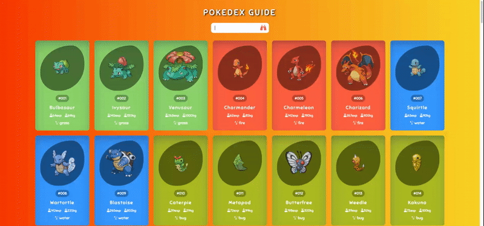

<h1> Pokedex Guide - GitHub README</h1>

Welcome to the GitHub repository for JS Pokedex Guide

<h2>Technologies Used</h2>
<ul>
    <li>HTML5</li>
    <li>CSS3</li>
    <li>JavaScript</li>
</ul>
<h2>About Pokedex Guide</h2>

In this project, it shows how to use the Fetch API to receive or send data to and from a server. The code covers basic scenarios such as retrieving JSON data or submitting a form to a server.

<a href="">preview</a>  

